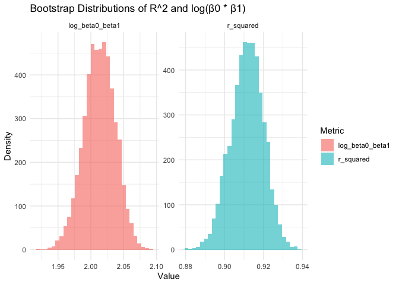
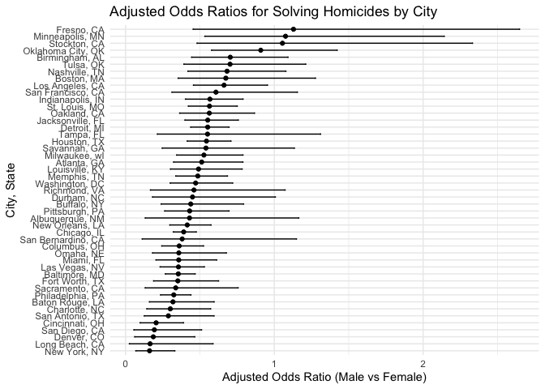
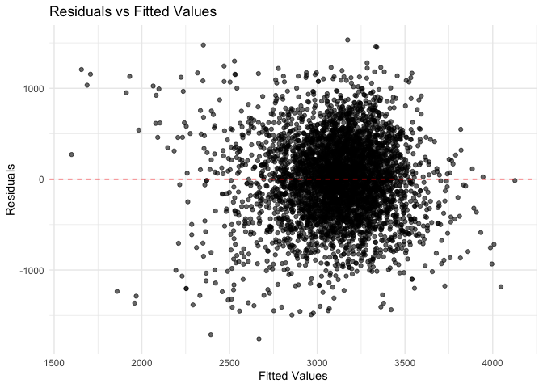
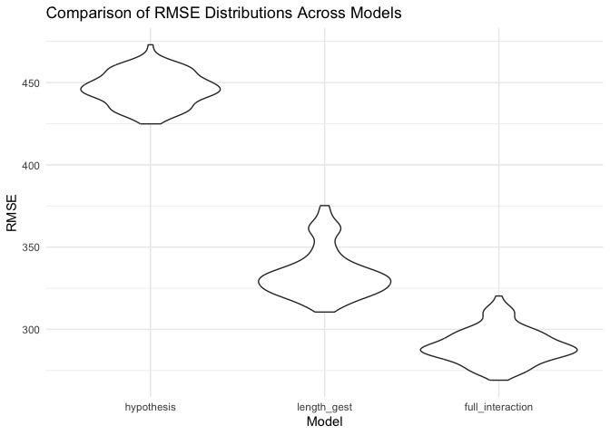

p8105_hw6
================
Zhengyong Chen

``` r
set.seed(123)
```

## Problem 1

``` r
weather_df = 
  rnoaa::meteo_pull_monitors(
    c("USW00094728"),
    var = c("PRCP", "TMIN", "TMAX"), 
    date_min = "2017-01-01",
    date_max = "2017-12-31") %>%
  mutate(
    name = recode(id, USW00094728 = "CentralPark_NY"),
    tmin = tmin / 10,
    tmax = tmax / 10) %>%
  select(name, id, everything())
```

``` r
bootstrap = function(data, n_bootstrap = 5000) {
  data |>
    modelr::bootstrap(n = n_bootstrap) |>
    mutate(
      models = map(strap, \(df) lm(tmax ~ tmin, data = as_tibble(df))),
      r_squared = map_dbl(models, \(mod) glance(mod)$r.squared),
      log_beta0_beta1 = map_dbl(models, \(mod) {
        coef_mod = tidy(mod)
        beta0 = coef_mod$estimate[coef_mod$term == "(Intercept)"]
        beta1 = coef_mod$estimate[coef_mod$term == "tmin"]
        log(beta0 * beta1)
      })
    ) |>
    select(r_squared, log_beta0_beta1)
}


bootstrap_results = bootstrap(weather_df, n_bootstrap = 5000)

conf_intervals =
  bootstrap_results |>
  summarise(
    r_squared_low = quantile(r_squared, 0.025),
    r_squared_high = quantile(r_squared, 0.975),
    log_beta0_beta1_low = quantile(log_beta0_beta1, 0.025),
    log_beta0_beta1_high = quantile(log_beta0_beta1, 0.975)
  )

conf_intervals |> 
  kable(caption = "95% confidence interval for R^2 and log(β0 * β1)",
        digits = 3)
```

| r_squared_low | r_squared_high | log_beta0_beta1_low | log_beta0_beta1_high |
|--------------:|---------------:|--------------------:|---------------------:|
|         0.895 |          0.927 |               1.964 |                2.058 |

95% confidence interval for R^2 and log(β0 \* β1)

``` r
bootstrap_results |>
  pivot_longer(cols = everything(), names_to = "metric", values_to = "value") |>
  ggplot(aes(x = value, fill = metric)) +
  geom_histogram(alpha = 0.6) +
  facet_wrap(~ metric, scales = "free") +
  labs(
    title = "Bootstrap Distributions of R^2 and log(β0 * β1)",
    x = "Value",
    y = "Density",
    fill = "Metric"
  ) +
  theme_minimal()
```

    ## `stat_bin()` using `bins = 30`. Pick better value with `binwidth`.

<!-- -->

Both metrics show narrow, symmetric distributions, indicating consistent
estimates from the bootstrap process. The distribution of
$\log(\beta_0 \cdot \beta_1)$ is approximately normal, centered around
2. The distribution of $R^2$ is also approximately normal, centered
around 0.91.

## Problem 2

``` r
homicide = read_csv("data/homicide-data.csv")
```

**Create a city_state variable, and a binary variable indicating whether
the homicide is solved.**

``` r
homicide = homicide |>
  mutate(city_state = paste(city, state, sep = ", ")) |>
  filter(
    !(city_state %in% c("Dallas, TX", "Phoenix, AZ", "Kansas City, MO", "Tulsa, AL")),
    victim_race %in% c("White", "Black"),
    victim_age != "Unknown"
  ) |>
  mutate(solved = ifelse(grepl("Closed", disposition, ignore.case = TRUE), 1, 0),
         victim_age = as.numeric(victim_age))
```

**Logistic regression for Baltimore**

``` r
baltimore_data = homicide |>
  filter(city_state == "Baltimore, MD") |> 
  mutate(victim_sex = factor(victim_sex, levels = c("Female", "Male")))

glm_fit = glm(
  solved ~ victim_age + victim_sex + victim_race,
  data = baltimore_data,
  family = binomial
)

glm_results = broom::tidy(glm_fit, conf.int = TRUE, exponentiate = TRUE)

glm_results |>
  filter(term == "victim_sexMale") |>
  select(estimate, conf.low, conf.high) |> 
  kable(
    col.names = c("Adjusted OR", "Lower CI", "Upper CI"),
    caption = "Adjusted Odds Ratio for Solving Homicides (Male vs Female)",
    digits = 3
  )
```

| Adjusted OR | Lower CI | Upper CI |
|------------:|---------:|---------:|
|       0.355 |    0.267 |    0.468 |

Adjusted Odds Ratio for Solving Homicides (Male vs Female)

**glm for each of the cities**

``` r
city_results = homicide |>
  group_by(city_state) |>
  nest() |>
  mutate(
    glm_fit = map(data, ~ glm(
      solved ~ victim_age + victim_sex + victim_race,
      data = .x,
      family = binomial
    )),
    glm_tidy = map(glm_fit, ~ broom::tidy(.x, conf.int = TRUE, exponentiate = TRUE))
  ) |>
  unnest(glm_tidy) |>
  filter(term == "victim_sexMale") |>
  select(city_state, estimate, conf.low, conf.high)

city_results |>
  kable(
    col.names = c("City, State", "Adjusted Odds Ratio", "Lower CI", "Upper CI"),
    caption = "Adjusted Odds Ratios for Solving Homicides (Male vs Female) by City", 
    digits = 3,
    options = list(pageLength = 10)
  ) 
```

| City, State        | Adjusted Odds Ratio | Lower CI | Upper CI |
|:-------------------|--------------------:|---------:|---------:|
| Albuquerque, NM    |               0.430 |    0.132 |    1.164 |
| Atlanta, GA        |               0.512 |    0.323 |    0.789 |
| Baltimore, MD      |               0.355 |    0.267 |    0.468 |
| Baton Rouge, LA    |               0.319 |    0.160 |    0.596 |
| Birmingham, AL     |               0.704 |    0.444 |    1.092 |
| Boston, MA         |               0.674 |    0.353 |    1.277 |
| Buffalo, NY        |               0.438 |    0.239 |    0.793 |
| Charlotte, NC      |               0.301 |    0.143 |    0.572 |
| Chicago, IL        |               0.391 |    0.321 |    0.476 |
| Cincinnati, OH     |               0.206 |    0.098 |    0.390 |
| Columbus, OH       |               0.361 |    0.243 |    0.525 |
| Denver, CO         |               0.187 |    0.061 |    0.466 |
| Detroit, MI        |               0.552 |    0.438 |    0.696 |
| Durham, NC         |               0.450 |    0.181 |    1.007 |
| Fort Worth, TX     |               0.351 |    0.189 |    0.625 |
| Fresno, CA         |               1.129 |    0.454 |    2.648 |
| Houston, TX        |               0.544 |    0.414 |    0.709 |
| Indianapolis, IN   |               0.567 |    0.403 |    0.790 |
| Jacksonville, FL   |               0.552 |    0.399 |    0.758 |
| Las Vegas, NV      |               0.356 |    0.232 |    0.530 |
| Long Beach, CA     |               0.165 |    0.026 |    0.588 |
| Los Angeles, CA    |               0.662 |    0.457 |    0.954 |
| Louisville, KY     |               0.491 |    0.301 |    0.784 |
| Memphis, TN        |               0.486 |    0.337 |    0.685 |
| Miami, FL          |               0.358 |    0.204 |    0.613 |
| Milwaukee, wI      |               0.527 |    0.343 |    0.789 |
| Minneapolis, MN    |               1.075 |    0.533 |    2.142 |
| Nashville, TN      |               0.682 |    0.419 |    1.078 |
| New Orleans, LA    |               0.415 |    0.297 |    0.575 |
| New York, NY       |               0.161 |    0.069 |    0.331 |
| Oakland, CA        |               0.563 |    0.364 |    0.867 |
| Oklahoma City, OK  |               0.909 |    0.578 |    1.423 |
| Omaha, NE          |               0.358 |    0.181 |    0.678 |
| Philadelphia, PA   |               0.324 |    0.235 |    0.440 |
| Pittsburgh, PA     |               0.431 |    0.263 |    0.696 |
| Richmond, VA       |               0.460 |    0.167 |    1.072 |
| San Antonio, TX    |               0.288 |    0.126 |    0.595 |
| Sacramento, CA     |               0.337 |    0.132 |    0.757 |
| Savannah, GA       |               0.540 |    0.246 |    1.135 |
| San Bernardino, CA |               0.380 |    0.112 |    1.149 |
| San Diego, CA      |               0.194 |    0.056 |    0.511 |
| San Francisco, CA  |               0.608 |    0.312 |    1.155 |
| St. Louis, MO      |               0.564 |    0.422 |    0.751 |
| Stockton, CA       |               1.055 |    0.480 |    2.332 |
| Tampa, FL          |               0.551 |    0.214 |    1.311 |
| Tulsa, OK          |               0.703 |    0.392 |    1.211 |
| Washington, DC     |               0.471 |    0.300 |    0.720 |

Adjusted Odds Ratios for Solving Homicides (Male vs Female) by City

**plot**

``` r
city_results |>
  arrange(estimate) |>
  ggplot(aes(x = estimate, y = reorder(city_state, estimate))) +
  geom_point() +
  geom_errorbarh(aes(xmin = conf.low, xmax = conf.high), height = 0.2) +
  labs(
    x = "Adjusted Odds Ratio (Male vs Female)",
    y = "City, State",
    title = "Adjusted Odds Ratios for Solving Homicides by City",
  ) +
  theme_minimal()
```

<!-- -->

Comment:  
Several cities (Fresno, Minneapolis, and Stockton) show ORs above 1,
suggesting male victims are more likely to have their cases solved,
while others are below 1, indicating in most cities, female victims are
more likely to have their cases solved. New York has the smallest
adjusted odds ratio. Some cities like Fresno and Stockton has wider
confidence intervals, indicating less precise estimates.

## Problem 3

**Load and clean the data.**

``` r
birthweight = read.csv("data/birthweight.csv") 

birthweight = birthweight |>
  mutate(
    babysex = factor(babysex, levels = c(1, 2), labels = c("Male", "Female")),
    frace = factor(frace, levels = c(1, 2, 3, 4, 8),
                   labels = c("White", "Black", "Asian", "Puerto Rican", "Other")),
    malform = factor(malform, levels = c(0, 1), labels = c("Absent", "Present")),
    mrace = factor(mrace, levels = c(1, 2, 3, 4, 8),
                   labels = c("White", "Black", "Asian", "Puerto Rican", "Other"))
  ) 

birthweight |>
  summarise_all(~ sum(is.na(.)))
```

    ##   babysex bhead blength bwt delwt fincome frace gaweeks malform menarche
    ## 1       0     0       0   0     0       0     0       0       0        0
    ##   mheight momage mrace parity pnumlbw pnumsga ppbmi ppwt smoken wtgain
    ## 1       0      0     0      0       0       0     0    0      0      0

I will use a hypothesized structure for the factors that underly
birthweight. I think it would be reasonable to include gaweeks, momage,
mheight, wtgain, and babysex.

``` r
model_hypothesis = lm(
  bwt ~ gaweeks + momage + mheight + wtgain + babysex,
  data = birthweight
)

birthweight = birthweight |>
  add_predictions(model_hypothesis, var = "fitted") |>
  add_residuals(model_hypothesis, var = "residual")

ggplot(birthweight, aes(x = fitted, y = residual)) +
  geom_point(alpha = 0.6) +
  geom_hline(yintercept = 0, linetype = "dashed", color = "red") +
  labs(
    x = "Fitted Values",
    y = "Residuals",
    title = "Residuals vs Fitted Values"
  ) +
  theme_minimal()
```

<!-- -->

**Comparison**

``` r
cv_df = crossv_mc(birthweight, 100) |> 
  mutate(
    train = map(train, as_tibble),
    test = map(test, as_tibble)
  )

cv_df = cv_df |> 
  mutate(
    hypothesis_mod = map(train, \(df) lm(bwt ~ gaweeks + momage + mheight + wtgain + babysex, data = df)),
    length_gest_mod = map(train, \(df) lm(bwt ~ blength + gaweeks, data = df)),
    full_interaction_mod = map(train, \(df) lm(bwt ~ bhead * blength * babysex, data = df))
  ) |> 
  mutate(
    rmse_hypothesis = map2_dbl(hypothesis_mod, test, \(mod, df) rmse(model = mod, data = df)),
    rmse_length_gest = map2_dbl(length_gest_mod, test, \(mod, df) rmse(model = mod, data = df)),
    rmse_full_interaction = map2_dbl(full_interaction_mod, test, \(mod, df) rmse(model = mod, data = df))
  )

cv_summary = cv_df|>
  summarise(
    hypothesis_mean_error = mean(rmse_hypothesis),
    length_gest_mean_error = mean(rmse_length_gest),
    full_interaction_mean_error = mean(rmse_full_interaction)
  )

cv_summary |> 
  kable()
```

| hypothesis_mean_error | length_gest_mean_error | full_interaction_mean_error |
|----------------------:|-----------------------:|----------------------------:|
|              446.2227 |               334.0658 |                    290.1019 |

``` r
rmse_results = cv_df |> 
  select(starts_with("rmse")) |> 
  pivot_longer(
    everything(),
    names_to = "model",
    values_to = "rmse",
    names_prefix = "rmse_"
  ) |> 
  mutate(model = fct_inorder(model))

ggplot(rmse_results, aes(x = model, y = rmse)) +
  geom_violin() +
  labs(
    x = "Model",
    y = "RMSE",
    title = "Comparison of RMSE Distributions Across Models"
  ) +
  theme_minimal()
```

<!-- -->
